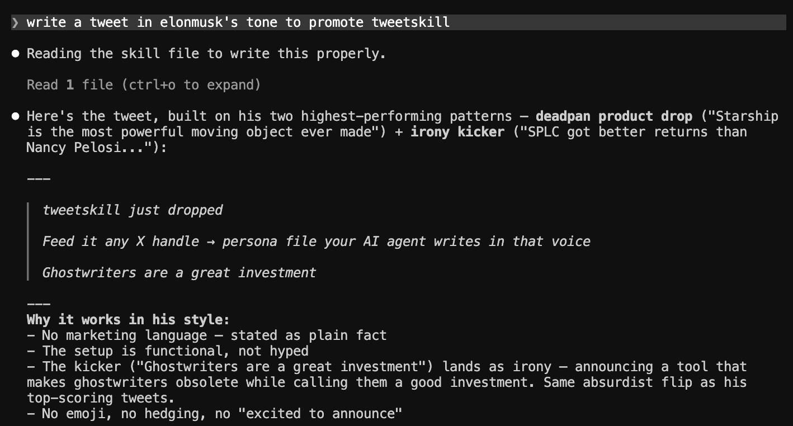

<div align="center">

# tweetskill

> *"Destile sua alma do X em um arquivo."*

[](LICENSE)
[](https://claude.ai/code)
[](https://skills.sh)

**Destile o histórico de tweets de qualquer conta X em um skill file que qualquer agente de IA pode usar.**

[Exemplo](#exemplo) · [O que você pode fazer](#o-que-você-pode-fazer-com-isso) · [Instalação](#instalação) · [Como funciona](#como-funciona) · [Custo](#custo)

**Outros idiomas：** [English](README.md) · [中文](README_CN.md) · [日本語](README_JA.md) · [한국어](README_KO.md) · [Español](README_ES.md) · [Deutsch](README_DE.md)

</div>



---

## Por que isso existe

A IA escreve tweets pra você. Mas dá pra ver que é IA.

Não é culpa do modelo — ele simplesmente não conhece sua voz. Como você se expressa. O que engaja. O que você jamais diria.

Você passou anos postando. Esse dado está dormindo nos servidores do X. Ninguém tinha transformado isso em algo que a IA pode usar de verdade.

É isso que o tweetskill faz.

Pega o histórico de tweets de qualquer conta → pontua com dados reais de engajamento → destila com um LLM → gera um skill file. Joga em qualquer agente e ele consegue escrever na voz daquela pessoa.

Não é roleplay. É uma destilação de como alguém opera de verdade na internet.

---

## Exemplo

Depois de analisar 200 tweets do `@elonmusk`, o `elonmusk-skill.md` fica assim:

```markdown
# Identity
Techno-industrialist and chaos agent operating across EV, space, AI, and social media.
Audience: everyone — speaks to engineers, investors, politicians, and shitposters simultaneously.
Positioning: the world's most powerful troll with actual rockets.

# Communication Style
Mostly English, dry and minimal. One-liners dominate. Emoji used sparingly for ironic effect.
No preamble. No sign-off. States things as obvious facts that aren't obvious.

# Signature Patterns
- Deadpan product drops — announces civilization-scale things like they're mundane
- Irony kicker — sets up a straight statement then lands a punchline that flips the frame
- Single-word or single-number tweets that force the reader to do the work
- Engages critics directly, often with less than 5 words

# Expression DNA
- "Congratulations to [X] on [absurd achievement]"
- "[Number]."
- "Interesting"
- "[Statement]. [Ironic contradiction]."

# Anti-Patterns
- Long explanatory threads
- Hedging language ("might", "possibly", "we think")
- Marketing copy or hype language
```

Joga isso no Claude Code, Hermes ou OpenClaw e pede "escreve um tweet sobre o tweetskill no tom do Elon" — ele sabe exatamente o que fazer.

---

## O que você pode fazer com isso

Com o arquivo skill, dá pra fazer muito mais do que você imagina.

### Escrever tweets originais na sua própria voz

O uso mais básico. Passa o arquivo skill pro agente, fala o tema, ele escreve.

```
Lê myaccount-skill.md e escreve um tweet sobre o lançamento do Claude Opus 4.7
```

```
Escreve 3 versões no meu estilo — eu escolho uma
```

Sem precisar explicar "não uso emoji" ou "coloca a conclusão primeiro" toda vez — já tá no skill file.

---

### Escrever respostas que soam como você

Você vê um tweet que quer responder mas não tem tempo de pensar como.

```
Lê myaccount-skill.md e responde esse tweet na minha voz: [cola o tweet]
```

O agente usa seus padrões de resposta — se você rebate, concorda ou adiciona um ponto.

---

### Pesquisar a estratégia de conteúdo de alguém

Analisa um concorrente ou uma conta que você quer aprender.

```
analyze @naval — me diz o que os tweets de alto engajamento têm em comum
```

Depois do skill file, você vê: que aberturas eles usam, quais tópicos aparecem sempre, quais formatos nunca tocam.

---

### Comparar dois estilos lado a lado

Mesmo tema, duas vozes diferentes.

```
Lê elonmusk-skill.md e vitalikbuterin-skill.md
Escreve um tweet sobre regulação de IA em cada estilo
```

---

### Definir uma voz persistente pro agente

Adiciona no `CLAUDE.md` ou no system prompt do agente:

```
Pra todos os tweets e respostas que você me ajudar a escrever, usa por padrão o estilo de myaccount-skill.md
```

Depois é só dizer "escreve um tweet sobre isso" e tá feito.

---

## Instalação

```bash
npx skills add DbgKinggg/tweetskill
```

No seu agente de IA:

```
analyze @elonmusk
```

O agente vai pedir seu X Bearer Token, buscar os tweets e gerar o `elonmusk-skill.md`.

Sem Python. Sem CLI. Só o agente.

---

## Como usar

### Opção 1: SKILL.md (recomendado)

Instala o skill, fala uma frase, o agente cuida do resto. Ideal pra quem já usa Claude Code, Hermes ou OpenClaw.

```
analyze @naval
```

### Opção 2: tweetskill.com (sem configuração)

Tudo pelo navegador. Conecta conta, analisa tweets, gera conteúdo e posta — tudo num lugar só.

👉 [tweetskill.com](https://tweetskill.com)

---

## Como funciona

4 etapas, sem mistério:

**1. Busca** — coleta tweets originais via X API v2 (retweets excluídos — isso não é a voz da pessoa)

**2. Pontuação** — calcula engajamento por tweet:
```
score = (likes + retweets×3 + replies×2) / impressions^0.3
```
Top 20% = sinal. Bottom 20% = antipadrões.

**3. Destilação** — passa os melhores e piores pro LLM juntos, extraindo:
- quais tópicos e aberturas geram mais engajamento
- a voz e o estilo real
- o que consistentemente não funciona nessa conta

**4. Exportação** — gera um skill file baseado em dados reais, não em suposições.

---

## Custo

O X API tem dois preços dependendo de quem são os tweets:

- **Owned reads** — tweets de [uma conta que você controla](https://docs.x.com/x-api/getting-started/pricing#owned-reads) (analisando sua própria conta). Mais barato.
- **Non-owned reads** — tweets de qualquer outra conta pública (analisando a conta de outra pessoa). Mais caro.

| Tweets | Owned reads | Non-owned reads | Observações |
|--------|-------------|-----------------|-------------|
| 50     | $0.05       | mais caro       | Rápido, superficial |
| 100    | $0.10       | mais caro       | Padrão recomendado |
| 200    | $0.20       | mais caro       | Análise completa |
| 500    | $0.50       | mais caro       | Análise profunda |
| Refresh | $0.01–0.05 | mais caro      | Só tweets novos |

> Preços podem mudar. Sempre confira a [página oficial de preços do X API](https://docs.x.com/x-api/getting-started/pricing) antes de estimar custos.

Obtenha seu Bearer Token em [developer.x.com](https://developer.x.com). O X API é pay per use — carregue saldo na sua conta de desenvolvedor antes de fazer chamadas. Veja a [introdução ao X API](https://docs.x.com/x-api/introduction) para mais detalhes.

---

## Usando o output

- **Claude Code** — `Read` o arquivo e peça pra escrever nessa voz
- **Hermes** — coloca em `~/.hermes/skills/`
- **OpenClaw** — adiciona ao diretório `skills/`
- **ElizaOS** — pede `--format eliza` pro `character.json`
- **Qualquer agente** — cola o conteúdo do arquivo no system prompt

---

## Sobre

Feito por [@DbgKinggg](https://x.com/DbgKinggg). Segue no X: [x.com/DbgKinggg](https://x.com/DbgKinggg)

---

<div align="center">

Seus dados do X são seus.<br>
Faça a IA entendê-los de verdade.

<br>

MIT License

</div>
